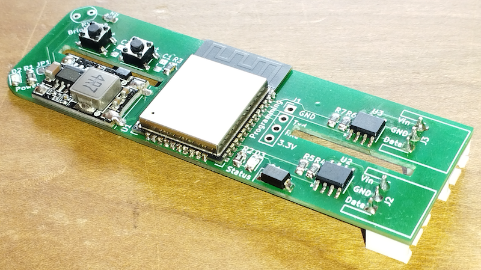

# PCB for AXA Remote

[![GitHub Release][releases-shield]][releases]
[![Licence][license-shield]][license]
[![Maintainer][maintainer-shield]][maintainer]  
[![GitHub Sponsors][github-shield]][github]
[![PayPal][paypal-shield]][paypal]
[![BuyMeCoffee][buymecoffee-shield]][buymecoffee]
[![Patreon][patreon-shield]][patreon]

## Introduction

I designed a PCB that fits in the battery compartment of the AXA Remote and can controll up to two
window openers. Only minor modifications to the battery compartment are needed. Contact me if you
like to buy one! You can find my email address on [my GitHub profile](https://github.com/rrooggiieerr).



PCB in the battery compartment:


### Features

- Fits in the AXA Remote battery compartment  
  Two slits in the PCB allow you to slide the PCB over the battery deviders in the battery
  compartment.
- Controll up to two AXA Remote window openers  
  Two LIN convertors allow you to connect to two different AXA Remote window openers.
- Powered from the AXA Remote power supply  
  A buit in power regulator brings the 7.5 Volt power of the AXA Remote to the 3.3 Volt that the
  ESP32 needs.
- Power pass trough to second window opener  
  The connector for connecting to a second window opener als delivers power, no need for a second
  power supply.
- Light sensor  
  A provided photoresistor can be soldered in place to make the firmware report light intensity.
- Easy connection to your local Wi-Fi network.  
  Implements a captive portal and the open [Improv Wi-Fi](https://www.improv-wifi.com/) standard
  via BLE to easily setup your local Wi-Fi network credentials.

## What's included

- PCB
- 40 cm RJ25 (6P6C) to JST connector cable
  To connect the AXA Remote to the PCB.
- RJ25 (6P6C) connector and 3 pin female JST connector + contacts
  To make your own wire for connection a second AXA Remote.
- Light-Dependent Resistor (LDR)
  To measure brightness.

## Installation

To fit the PCB in the battery compartment of the AXA Remote two minor modifications are needed.

First the battery clip needs to be removed, you can easily slide this out battery compartment.

Then a small notch needs to be cut out the battery compartment to guide the wire out of the battery
compartment towards the cable duct that guides the cable to the RJ25 (6P6C) connector of the AXA
Remote.

Connect the RJ25 (6P6C) side of the provided cable to the AXA Remote and guide the wire trough the
cable duct. Then connect the JST connector to J2/AXA 1 on the PCB.

J3/AXA 2 can be used to connect a second AXA Remote. By default the power of the primary AXA Remote
is forwarded to the secondary, but if this secondary AXA Remote has it's own powersupply you can
cut JP3 and JP3 to diable the power forwarding.

### Connecting the Light-Dependent Resistor (LDR)

You can solder the provided LDR on solderpads R9/Brightness of the PCB. The LDR does not have a polarity, orientation does mot matter. You can drill a 5 mm hole in the casing of the AXA Remote and let the LDR peek trough.

## Connecting the PCB to your Wi-Fi network and Home Assistant

The ESPHome based firmware implements the open Improv Wi-Fi standard via BLE. If you use BLE Proxies in your Home Assistant the PCB will automatically be detected and an authentication workflow.

When using Improv Wi-Fi via BLE you need to press the boot button to authorize the 

## Updating the firmware

The PCB comes with a version of ESPHome and the AXA Remote component installed and configured for one AXA Remote. If you want to enable the support for a second AXA Remote you need to update the firmware.

## ESPHome example configuration

```
ToDo
```

## Factory reseting the firmware

ToDo

## Star this external component

Help other ESPHome and AXA Remote users find this external component by starring this GitHub page.
Click **⭐ Star** on the top right of the GitHub page.

## Support my work

Do you enjoy using this ESPHome component? Then consider supporting my work using one of the
following platforms, your donation is greatly appreciated and keeps me motivated:

[![GitHub Sponsors][github-shield]][github]
[![PayPal][paypal-shield]][paypal]
[![BuyMeCoffee][buymecoffee-shield]][buymecoffee]
[![Patreon][patreon-shield]][patreon]

## Hire me

If you're in need for a freelance ESP developer for your project please contact me, you can find my
email address on [my GitHub profile](https://github.com/rrooggiieerr).

[releases]: https://github.com/rrooggiieerr/esphome-axaremote/releases
[releases-shield]: https://img.shields.io/github/v/release/rrooggiieerr/esphome-axaremote?style=for-the-badge
[license]: ./LICENSE
[license-shield]: https://img.shields.io/github/license/rrooggiieerr/esphome-axaremote?style=for-the-badge
[maintainer]: https://github.com/rrooggiieerr
[maintainer-shield]: https://img.shields.io/badge/MAINTAINER-%40rrooggiieerr-41BDF5?style=for-the-badge
[paypal]: https://paypal.me/seekingtheedge
[paypal-shield]: https://img.shields.io/badge/PayPal-00457C?style=for-the-badge&logo=paypal&logoColor=white
[buymecoffee]: https://www.buymeacoffee.com/rrooggiieerr
[buymecoffee-shield]: https://img.shields.io/badge/Buy%20Me%20a%20Coffee-ffdd00?style=for-the-badge&logo=buy-me-a-coffee&logoColor=black
[github]: https://github.com/sponsors/rrooggiieerr
[github-shield]: https://img.shields.io/badge/sponsor-30363D?style=for-the-badge&logo=GitHub-Sponsors&logoColor=ea4aaa
[patreon]: https://www.patreon.com/seekingtheedge/creators
[patreon-shield]: https://img.shields.io/badge/Patreon-F96854?style=for-the-badge&logo=patreon&logoColor=white
