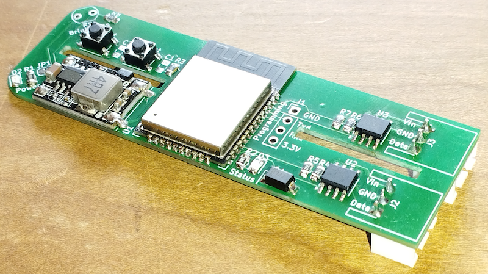

# PCB for AXA Remote

[![GitHub Release][releases-shield]][releases]
[![Licence][license-shield]][license]
[![Maintainer][maintainer-shield]][maintainer]  
[![GitHub Sponsors][github-shield]][github]
[![PayPal][paypal-shield]][paypal]
[![BuyMeCoffee][buymecoffee-shield]][buymecoffee]
[![Patreon][patreon-shield]][patreon]

## Introduction

I designed a PCB that fits in the battery compartment of the AXA Remote and can control up to two
window openers. Only minor modifications to the battery compartment are needed. Contact me if you
like to buy one! You can find my email address on [my GitHub profile](https://github.com/rrooggiieerr).



This PCB or the ESPHome External Component is in no way affiliated with the AXA Home Security brand.

### Features

- Fits in the AXA Remote battery compartment  
  Two slits in the PCB allow you to slide the PCB over the battery dividers in the battery
  compartment.
- Control up to two AXA Remote window openers  
  Two LIN converters allow you to connect to two different AXA Remote window openers.
- Powered from the AXA Remote power supply  
  A built in power regulator brings the 7.5 Volt power of the AXA Remote to the 3.3 Volt that the
  ESP32 needs.
- Power pass through to second window opener  
  The connector for connecting to a second window opener also delivers power, no need for a second
  power supply.
- Light sensor  
  A provided photoresistor can be soldered in place to make the firmware report light intensity.
- Easy connection to your local Wi-Fi network.  
  Implements a captive portal and the open [Improv Wi-Fi](https://www.improv-wifi.com/) standard
  via BLE to easily setup your local Wi-Fi network credentials.

## What's included

- PCB
- 40 cm RJ25 (6P6C) to JST XH connector cable  
  To connect the AXA Remote to the PCB.
- RJ25 (6P6C) connector and 3 pin female JST XH connector + contacts  
  To make your own wire for connecting a second AXA Remote.
- Light-Dependent Resistor (LDR)  
  To measure brightness.

You need to create the second cable yourself with the provided RJ25 and JST XH connectors and
your own cable. You can just use a 4 wire phone cable and only use 3 of those wires for Vin,
Ground ad Data.

Because you need to drill a hole in the AXA Remote housing and not everyone might want to do
that, you need to solder on the LDR yourself. The rest of the PCB is fully assembled.

## Installation

### [Hardware Installation](Hardware Installation.md)

### [Wi-Fi Configuration](WiFi Configuration.md)

### Home Assistant configuration

After completing the Wi-Fi configuration the ESPHome integration will automatically discover the
AXA Remote PCB if the PCB is on the same network as your Home Assistant. You can then follow the
ESPHome configuration flow to add the PCB to your Home Assistant.


### Other Home Automation systems

ToDo figure put how to configure in other home automation systems. MQTT?

## Updating the firmware

The _ESPHome Device Builder_ software will automatically discover the firmware on the PCB and
suggest to take control over the device. After taking control over the device you are able to
modify and run your own ESPHome firmware on the PCB.

_ESPHome example configuration after taking controll_

```yaml
substitutions:
  name: axa-remote-pcb-4131b0
  friendly_name: AXA Remote 4131b0
packages:
  rrooggiieerr.axaremote: github://rrooggiieerr/esphome-axaremote/axa-remote-pcb.yaml@main
esphome:
  name: ${name}
  name_add_mac_suffix: false
  friendly_name: ${friendly_name}
api:
  encryption:
    key: ...

wifi:
  ssid: !secret wifi_ssid
  password: !secret wifi_password
```

After updating the firmware with your own version automatic firmware updates will no longer work!

### Setting the close duration

By default the firmware is configured to auto calibrate the unlock, open, close and lock durations
every time the window is closed from fully open to fully closed and locked. If you prefer to set a
fixed time for your window you can override this configuration. To do this open the window fully
and the close the window. The component will measure the time it takes until the lock is in one of
the locked states. By default the close duration is logged as info message to the ESPHome logging
console. You can then use this value to set the `close_duration` of your ESPHome configuration.

```yaml
cover:
  - id: !extend cover_axa1
    auto_calibrate: False
    close_duration: 35s
  - id: !extend cover_axa2
    auto_calibrate: False
    close_duration: 35s
```

### Adding BLE Tracker and Bluetooth Proxy

The ESP32 used on the PCB has Bluetooth capabilities and can thus be used as a BLE Tracker or
Bluetooth Proxy.

To enable the BLE Tracker component add the following line to the ESPHome configuration file.

```yaml
esp32_ble_tracker:
```

To enable the Bluetooth Proxy component add the following line to the ESPHome configuration file.

```yaml
bluetooth_proxy:
```

### [GPIO](GPIO.md)

### [Factory Reset](Factory Reset.md)

## Contribution and appreciation

You can contribute to this component, or show your appreciation, in the following ways.

### Star this external component

Help other ESPHome and AXA Remote users find this external component by starring this GitHub page.
Click **⭐ Star** on the top right of the GitHub page.

### Support my work

Do you enjoy using this ESPHome component? Please consider supporting my work through one of the
following platforms, your donation is greatly appreciated and keeps me motivated:

[![GitHub Sponsors][github-shield]][github]
[![PayPal][paypal-shield]][paypal]
[![BuyMeCoffee][buymecoffee-shield]][buymecoffee]
[![Patreon][patreon-shield]][patreon]

### ESPHome support

[Book a one-hour ESPHome support session](https://buymeacoffee.com/rrooggiieerr/e/470127). I’ll
help you troubleshoot your ESPHome setup or answer your ESPHome-related questions.

What can be done in one hour:

- ESPHome walktrough, I explain to you how ESPHome works
- Assistance setting up your ESP device
- Install and configure an ESPHome (External) Component

What takes more time:

- Support for ESPHome Component developers

### Hire me

If you would like to have an ESPHome component developed for your product or are in need for a
freelance ESP developer for your project please contact me, you can find my email address on
[my GitHub profile](https://github.com/rrooggiieerr).

[releases]: https://github.com/rrooggiieerr/esphome-axaremote/releases
[releases-shield]: https://img.shields.io/github/v/release/rrooggiieerr/esphome-axaremote?style=for-the-badge
[license]: ./LICENSE
[license-shield]: https://img.shields.io/github/license/rrooggiieerr/esphome-axaremote?style=for-the-badge
[maintainer]: https://github.com/rrooggiieerr
[maintainer-shield]: https://img.shields.io/badge/MAINTAINER-%40rrooggiieerr-41BDF5?style=for-the-badge
[paypal]: https://paypal.me/seekingtheedge
[paypal-shield]: https://img.shields.io/badge/PayPal-00457C?style=for-the-badge&logo=paypal&logoColor=white
[buymecoffee]: https://www.buymeacoffee.com/rrooggiieerr
[buymecoffee-shield]: https://img.shields.io/badge/Buy%20Me%20a%20Coffee-ffdd00?style=for-the-badge&logo=buy-me-a-coffee&logoColor=black
[github]: https://github.com/sponsors/rrooggiieerr
[github-shield]: https://img.shields.io/badge/sponsor-30363D?style=for-the-badge&logo=GitHub-Sponsors&logoColor=ea4aaa
[patreon]: https://www.patreon.com/seekingtheedge/creators
[patreon-shield]: https://img.shields.io/badge/Patreon-F96854?style=for-the-badge&logo=patreon&logoColor=white
