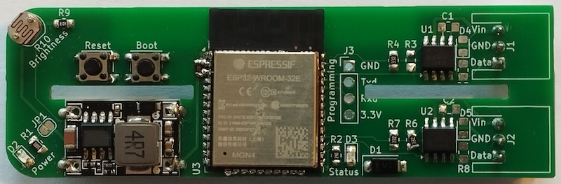
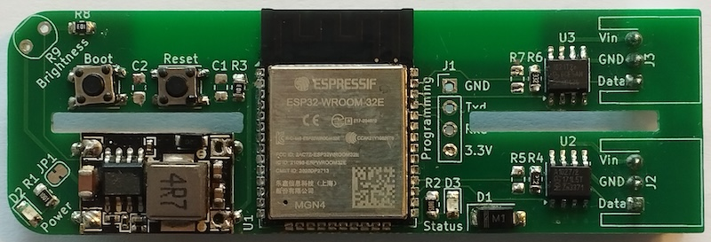
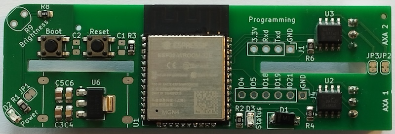
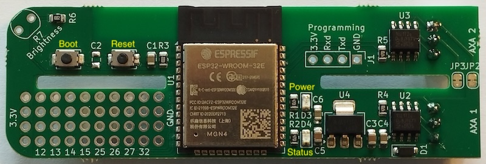

# PCB Revisions

Over the course of this project I have developed various revisions of the PCB, echa version improving on the previous one.

## v0.1

This revision never made it outside the lab, it didn't fit in the battery compartment and was missing a crucial resistor.

## v0.2

This revision also never made it outside the lab. It fitted the battery compartment but was still missing a crucial resistor.

## v0.3

This version used an off the shelf buck converter from Aliexpress and was totally hand soldered. 3 of them made it out the lab including one with a bodge wire.

## v0.4

This version has the LIN converters reconfigured. It is almost entirely populated by the PCB factory, only the ESP32 and 2 passives were hand soldered. It has 5 GPIO exposed that can be used for additional sensors.

The GPIO exposed are GPIO4, GPIO5, GPIO18, GPIO19 and GPIO21.

## v0.5

This version has the board redesigned to make space for a prototype board and 8 GPIO exposed.

The left side of the prototype board has 4 3.3 Volt pads on the left side and 4 Ground pads on the right side. At the bottom the GPIOs GPIO12, GPIO13, GPIO14, GPIO15, GPIO25, GPIO26, GPIO27 and GPIO32 are exposed and the inner 3 x 8 pads are not connected and available for your own components.

Due to a bug in the PCB design software I used the labels for the Boot and Reset buttons as well as the Power and Status LED are missing from the silkscreen. The location of these labels are added to the above image in yellow.

## v0.6

Will have the labels on the front silkscreen fixed