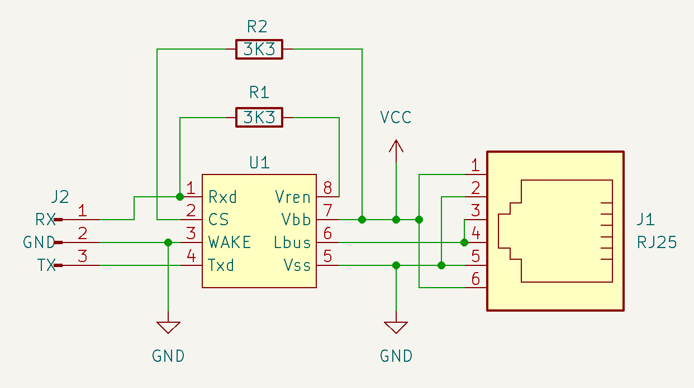

# AXA Remote component for ESPHome.

[![GitHub Release][releases-shield]][releases]
[![Licence][license-shield]][license]
[![Maintainer][maintainer-shield]][maintainer]  
[![Github Sponsors][github-shield]][github]
[![PayPal][paypal-shield]][paypal]
[![BuyMeCoffee][buymecoffee-shield]][buymecoffee]
[![Patreon][patreon-shield]][patreon]

## Introduction

This [ESPHome External Component](https://esphome.io/components/external_components) lets you
control an AXA Remote window opener.

Features:
- Open/Stop/Close the window
- Move window to a given position
- Calibrate the open/close timings
- Use remote control simultaneously

### Using the remote

The AXA Remote only reports if the device is locked or unlocked. When using the remote to open the
window from a closed position the integration can detect this and report the state accordingly. The
same applies for closing the window with the remote till a fully closed position. However stopping
the window or partially opening/closing the window can not be detected and the exact position the
window is opend at will not correspond with the real position.

## Hardware required:

- ESP8266, ESP32 or other ESPHome supported microcontroller
- LIN-bus controller or any other kind of level converter
- External power supply

### Wiring

The AXA Remote has identical two RJ12 (6P6C) connectors, each pin on the connector are connected
with eachother. The pinout is as follows:

|Pin|Function|
|:-:|:------:|
| 1 |   Vin  |
| 2 |   GND  |
| 3 |  RX/TX |
| 4 |  RX/TX |
| 5 |   GND  |
| 6 |   Vin  |

Wiring a LIN-bus controller as level converter goes as follows:



### Powering the AXA Remote

The outer pins of the RJ12 are the + voltage input and pin 2/5 the 0 voltage. The offical AXA
Remote power supply delivers 7.5 Volt, however the device also seems to work fine on 9 Volt. The
voltage does influence the speed and noise of the device, a lower voltage runs the device slower
and less noisy while a higher voltage faster and noisier.

## Protocol

This are the protocol details:  

19200 baud 8N2  
Device command: `\r\nDEVICE\r\n`  
Version command: `\r\nVERSION\r\n`  
Status command: `\r\nSTATUS\r\n`  
Open command: `\r\nOPEN\r\n`  
Stop command: `\r\nSTOP\r\n`  
Close command: `\r\nCLOSE\r\n`

### Lock states

- Unlocked
- Strong Locked
- Weak Locked
- Error

## ESPHome example configuration:
```
esphome:
  name: axaremote
  friendly_name: AXA Remote

external_components:
  - source: github://rrooggiieerr/esphome-axaremote

esp8266:
  board: nodemcu

# Enable logging
logger:
  level: INFO

# Enable Home Assistant API
api:
  encryption:
    key: ...

ota:
  - platform: esphome
    password: ...

wifi:
  ssid: !secret wifi_ssid
  password: !secret wifi_password

uart:
  tx_pin: ...
  rx_pin: ...
  baud_rate: 19200
  stop_bits: 2

cover:
  - platform: axaremote
    name: "AXA Remote"
    close_duration: 50s
    auto_calibrate: True
```

### Configuration variables:

- __close_duration__ (Optional): The close duration from fully open to fully locked. From this time
  the unlock, open, close and lock durations are derived.
- __auto_calibrate__ (Optional): Enable/disable auto calibration of the unlock, open, close and
  lock durations.

### Calibration

This AXA Remote component for ESPHome can automatically calibrate the unlock, open, close and lock
durations. To do this open the window fully and close the window from the ESPHome device. The
component will measure the time it takes untill the lock is in one of the locked states. By default
the close duration is logged as info message to the ESPHome logging console. You can then use this
value to set the __close_duration__ of your ESPHome configuration YAML. You can also enable
__auto_calibrate__ which will automatically update the unlock, open, close and lock durations every
time the window is closed from fully open to fully closed and locked.


## Support my work

Do you enjoy using this ESPHome component? Then consider supporting my work using one of the
following platforms, your donation is greatly appreciated and keeps me motivated:

[![Github Sponsors][github-shield]][github]
[![PayPal][paypal-shield]][paypal]
[![BuyMeCoffee][buymecoffee-shield]][buymecoffee]
[![Patreon][patreon-shield]][patreon]

## Hire me

If you're in need for a freelance ESP developer for your project please contact me, you can find my
email address on [my GitHub profile](https://github.com/rrooggiieerr).

[releases]: https://github.com/rrooggiieerr/esphome-axaremote/releases
[releases-shield]: https://img.shields.io/github/v/release/rrooggiieerr/esphome-axaremote?style=for-the-badge
[license]: ./LICENSE
[license-shield]: https://img.shields.io/github/license/rrooggiieerr/esphome-axaremote?style=for-the-badge
[maintainer]: https://github.com/rrooggiieerr
[maintainer-shield]: https://img.shields.io/badge/MAINTAINER-%40rrooggiieerr-41BDF5?style=for-the-badge
[paypal]: https://paypal.me/seekingtheedge
[paypal-shield]: https://img.shields.io/badge/PayPal-00457C?style=for-the-badge&logo=paypal&logoColor=white
[buymecoffee]: https://www.buymeacoffee.com/rrooggiieerr
[buymecoffee-shield]: https://img.shields.io/badge/Buy%20Me%20a%20Coffee-ffdd00?style=for-the-badge&logo=buy-me-a-coffee&logoColor=black
[github]: https://github.com/sponsors/rrooggiieerr
[github-shield]: https://img.shields.io/badge/sponsor-30363D?style=for-the-badge&logo=GitHub-Sponsors&logoColor=ea4aaa
[patreon]: https://www.patreon.com/seekingtheedge/creators
[patreon-shield]: https://img.shields.io/badge/Patreon-F96854?style=for-the-badge&logo=patreon&logoColor=white